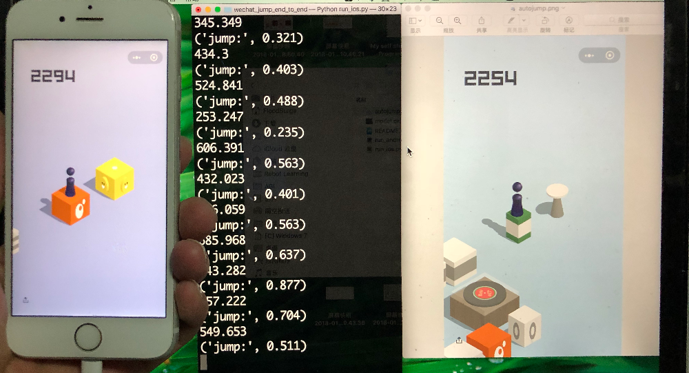

# Wechat_Jump_End_to_End



## Prerequisite

pytorch

## How to use it

Connect your iPhone or Android to your computer, follow this guide:

[Android and iOS connection guide](https://github.com/wangshub/wechat_jump_game/wiki/Android-%E5%92%8C-iOS-%E6%93%8D%E4%BD%9C%E6%AD%A5%E9%AA%A4)

Then:

```
python run_ios.py

or 

python run_android.py

```

## Note

The code is tested on iPhone 6s and Xiaomi Note3. 

Due to different screen pixels on different phones, you have to adjust SCALE value in the code so as to run successfully on your device.

Just adjust SCALE value in [0.9,1.1]. 

Have Fun!